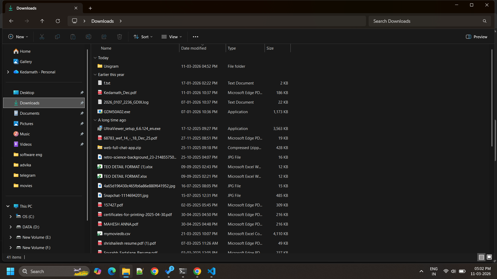
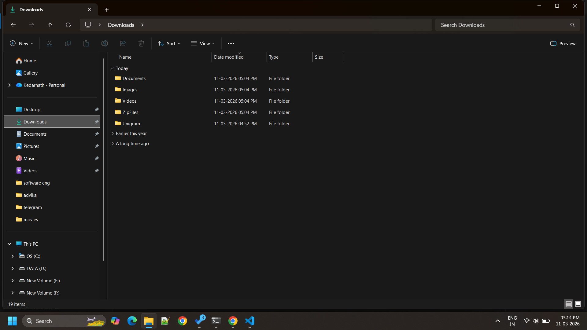

# Day 01 - Downloads Folder Organizer

## Problem
Downloads folder becomes messy with many file types.

## Solution
Python automation script organizes files automatically.

---

## Before Running Script

---

## Running Script

---

## After Running Script

---

## Technologies Used
- Python
- os module
- shutil module# Day 01 - Downloads Folder Organizer

## Problem
Downloads folder becomes messy with many file types.

## Solution
Python automation script organizes files automatically.

---

## Before Running Script

---

## After Running Script

---

## Technologies Used
- Python
- os module
- shutil module